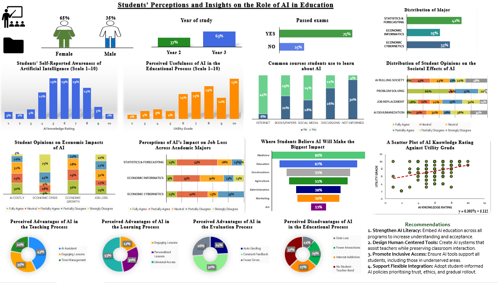

<h1 align="center">📊 Students' Perceptions of AI in Education 📊</h1>

### 🌐 View the Full Report Website  
Access the full interactive report and visualizations on the project website:  
🔗 [ai-student-vision-web.lovable.app](https://ai-student-vision-web.lovable.app/)

### Live Report ➤ [Read the Medium Article](https://medium.com/@johnmwangimegwe/students-perceptions-and-insights-on-the-role-of-ai-in-education-02274ef5d33b)

<a href="https://github.com/johnmwangimegwe/Students-Perceptions-of-AI-in-Education"></a>
<a href="https://github.com/johnmwangimegwe/Students-Perceptions-of-AI-in-Education"></a>
<a href="https://github.com/johnmwangimegwe/Students-Perceptions-of-AI-in-Education"></a>
<a href="https://github.com/johnmwangimegwe/Students-Perceptions-of-AI-in-Education"></a>

---
## 💡 Inspiration

As AI becomes deeply embedded in education, we realized there was little empirical data reflecting how students—the primary users—actually perceive its role. This project was inspired by the need to bridge that gap. We wanted to uncover student attitudes, concerns, and hopes about AI to help universities, EdTech developers, and policymakers design more aligned, ethical, and effective AI solutions in education.

## 📁 Overview
This project presents a structured analysis of how students perceive the growing role of Artificial Intelligence in the academic environment. It combines survey data, data visualization, and critical insights into a fully interactive dashboard. The project supports educational institutions, policymakers, and EdTech companies in understanding where AI is most accepted—and where caution or improvement is needed.

## 🔧 How to Use the Dashboard
This project was fully built in **Excel**, and the interactive dashboard can be viewed via the GitHub repository image or Medium article.

📍 **Dashboard Image:**  


📘 **Detailed Report Article:**  
[Read Full Medium Post](https://medium.com/@johnmwangimegwe/students-perceptions-and-insights-on-the-role-of-ai-in-education-02274ef5d33b)

---

## 🧠 Project Purpose
To uncover how students (future professionals) perceive the usefulness, risks, and sectoral impact of AI in education, and to align curriculum, tools, and policies accordingly.

---

## ⚙ What It Does
- Captures students' AI knowledge levels and preferred learning sources
- Analyzes emotional and economic perceptions of AI (e.g., job loss, societal impact)
- Identifies key sectors where students expect AI to dominate (e.g., Medicine, Education)
- Maps perceived usefulness of AI in teaching, learning, and evaluation
- Shows the correlation between AI knowledge and acceptance of AI tools

---

## 📌 Key Insights
- Internet (44%) and social media (24%) are top AI learning sources
- 66% agree AI solves societal problems; 35% worry about job replacement
- 23% rated AI's usefulness in education at 10/10
- Highest perceived benefit: Universal access (53%)
- Strong correlation between AI knowledge and openness to its use

---

## 📊 Tools Used
- **Excel** – Data cleaning, pivot analysis, and dashboard creation
- **Charts** – Bar, stacked bar, donut, funnel, and scatter plots
- **Design** – Dashboard color-coded by category and insight for clarity

---

## 🧩 Project Structure
```
/Students-Perceptions-of-AI-in-Education
├── Dashboard (Excel file + PNG preview)
├── Report (Medium article linked)
├── README.md
```

---

## 📚 What We Learned
Students are ready for AI in education but want tools that support—not replace—teachers. Knowledge is the biggest predictor of acceptance. Building awareness, ethical frameworks, and hybrid AI systems is key to successful adoption.

---

## 🙌 Want to contribute?
If you'd like to contribute data analysis, dashboard design, or education strategy enhancements, fork the repo and raise a pull request.

1. Fork this repository  
2. Clone your fork
```bash
git clone https://github.com/<your-username>/Students-Perceptions-of-AI-in-Education.git
```
3. Create a branch
```bash
git checkout -b feature/your-feature-name
```
4. Make changes and commit them
```bash
git add .
git commit -m "Add: feature description"
```
5. Push your changes and open a Pull Request
```bash
git push origin feature/your-feature-name
```
---

> **Connect** with the project owner via Medium: [@johnmwangimegwe](https://medium.com/@johnmwangimegwe)
